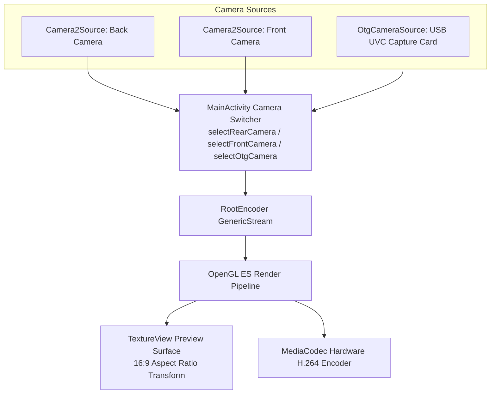
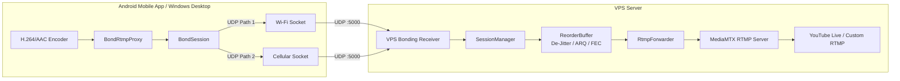

# StreamEzy BondStream — Comprehensive Project Architecture Report

> **Stage 1 Deliverable — Repository Audit**  
> Inspection Date: September 2026  
> Baseline Checkpoint: `baseline-before-bonding` / `stage-01-complete`

---

## Executive Summary

This architecture report provides a complete, exhaustive audit of the existing live streaming application across the Android mobile codebase (`mobile-capture-streamer`), the VPS bonding server (`bonding_server` & `server`), and the desktop streaming client (`windows-capture-streamer`).

The primary objective is to upgrade the system into an enterprise-grade, **LiveU-style bonded live video streaming system** across 12 structured development stages without breaking or modifying existing camera, audio, aspect-ratio, or direct RTMP streaming capabilities.

---

## 1. Android Package Structure & Component Map

### Package: `com.streamezy.capture`

| Class / File | Responsibility | Integration Role |
|---|---|---|
| [`MainActivity.kt`](file:///c:/Users/Admin/vps/mobile-capture-streamer/android/app/src/main/java/com/streamezy/capture/MainActivity.kt) | Central UI controller: coordinates camera preview, audio controls, Go Live flow, bonding session lifecycle, settings dialog, and Network Center modal. | Orchestrates stream start/stop and routes stream output via `BondRtmpProxy`. |
| [`StreamConfig.kt`](file:///c:/Users/Admin/vps/mobile-capture-streamer/android/app/src/main/java/com/streamezy/capture/StreamConfig.kt) | SharedPreferences persistence for RTMP endpoints, stream keys, bonding toggles, server address/port, playout delay, ARQ, redundancy, and FEC settings. | Centralized configuration repository. |
| [`AudioProcessor.kt`](file:///c:/Users/Admin/vps/mobile-capture-streamer/android/app/src/main/java/com/streamezy/capture/AudioProcessor.kt) | Implements `CustomAudioEffect` for RootEncoder: mixes background PCM audio with live microphone audio, applies noise reduction, master volume, and computes audio levels. | In-line audio filter pipeline. |
| [`AudioDecoder.kt`](file:///c:/Users/Admin/vps/mobile-capture-streamer/android/app/src/main/java/com/streamezy/capture/AudioDecoder.kt) | Uses Android `MediaExtractor` and `MediaCodec` to decode custom audio files (MP3, AAC, WAV) into raw 44.1 kHz 16-bit PCM for background music injection. | Media decoding utility. |
| [`OtgCameraSource.kt`](file:///c:/Users/Admin/vps/mobile-capture-streamer/android/app/src/main/java/com/streamezy/capture/OtgCameraSource.kt) | Custom video source subclassing RootEncoder's `VideoSource`, interfacing with `com.herohan:UVCAndroid` for USB OTG video capture cards. | External HDMI/UVC camera driver. |

---

### Package: `com.streamezy.capture.bonding`

| Class / File | Responsibility | Integration Role |
|---|---|---|
| [`NetworkPath.kt`](file:///c:/Users/Admin/vps/mobile-capture-streamer/android/app/src/main/java/com/streamezy/capture/bonding/NetworkPath.kt) | Abstraction representing an independent physical network interface (Wi-Fi, Cellular, Ethernet, USB) with health metrics. | Core model for multi-path telemetry. |
| [`AndroidNetworkManager.kt`](file:///c:/Users/Admin/vps/mobile-capture-streamer/android/app/src/main/java/com/streamezy/capture/bonding/AndroidNetworkManager.kt) | Interfaces with Android `ConnectivityManager` to discover active networks and bind dedicated UDP sockets to each interface via `Network.bindSocket()`. | Interface discovery & socket binding. |
| [`BondPacket.kt`](file:///c:/Users/Admin/vps/mobile-capture-streamer/android/app/src/main/java/com/streamezy/capture/bonding/BondPacket.kt) | Defines the 36-byte binary protocol header (magic `0x42 0x53`, version, type, flags, session ID, sequence, timestamp, length, CRC32). | Binary wire protocol serialization. |
| [`BondPathClient.kt`](file:///c:/Users/Admin/vps/mobile-capture-streamer/android/app/src/main/java/com/streamezy/capture/bonding/BondPathClient.kt) | Dedicated UDP worker thread per physical network path: handles packet transmission, heartbeat probes, RTT calculation, and downlink feedback. | Path transport worker. |
| [`BondRtmpProxy.kt`](file:///c:/Users/Admin/vps/mobile-capture-streamer/android/app/src/main/java/com/streamezy/capture/bonding/BondRtmpProxy.kt) | Local loopback TCP server (`127.0.0.1`) that accepts RootEncoder RTMP stream, chunks it into MTU-safe units (≤ 1380 bytes), and pipes it into `BondSession`. | Encoder-to-bonding bridge. |
| [`BondScheduler.kt`](file:///c:/Users/Admin/vps/mobile-capture-streamer/android/app/src/main/java/com/streamezy/capture/bonding/BondScheduler.kt) | Distributes outgoing packets across active network paths based on latency, loss rate, and path health. | Dynamic packet scheduler. |
| [`BondSession.kt`](file:///c:/Users/Admin/vps/mobile-capture-streamer/android/app/src/main/java/com/streamezy/capture/bonding/BondSession.kt) | Orchestrates multi-path session: manages 2048-packet ARQ rolling ring buffer, proactive FLV header duplication, and FEC XOR parity block generation. | Master client bonding controller. |
| [`BondTestRunner.kt`](file:///c:/Users/Admin/vps/mobile-capture-streamer/android/app/src/main/java/com/streamezy/capture/bonding/BondTestRunner.kt) | Probes multi-path connectivity to VPS, reporting latency, jitter, and available bandwidth before going live. | Diagnostic benchmark runner. |

---

## 2. Activities, Fragments, and Services

- **Activities**:
  - `com.streamezy.capture.MainActivity`: The single core Activity of the application (`launchMode="singleTask"`). It maintains the OpenGL preview surface, manages hardware resources, and coordinates live streaming.
- **Fragments**: None. The UI is implemented cleanly with customized ViewGroups, dialogs, and panels to minimize fragment lifecycle overhead.
- **Services**: Currently, the application runs within the foreground Activity lifecycle with `FLAG_KEEP_SCREEN_ON`.
  - *Future Stage Integration Point*: An optional Android `ForegroundService` can be introduced to keep the bonding session and encoder alive even when the app is minimized or the screen turns off.

---

## 3. Subsystem Architecture

### 3.1 Camera Subsystem



- **Back Camera**: Managed via `Camera2Source(this)` configured for `CameraHelper.Facing.BACK`.
- **Front Camera**: Managed via `Camera2Source(this)` configured for `CameraHelper.Facing.FRONT`.
- **OTG / External Camera**: Managed via `OtgCameraSource` wrapping `com.herohan:UVCAndroid` for HDMI capture cards and USB webcams.
- **Seamless Camera Switching**:
  - Switching between Front and Rear uses `camera2Source.switchCamera()`.
  - Switching to/from OTG uses `genericStream?.changeVideoSource(...)`.
  - **Critical Invariant**: Switching cameras **never** tears down or resets the network bonding session or RTMP socket.

### 3.2 Audio Subsystem

- **Hardware Input**: RootEncoder `MicrophoneSource` (44.1 kHz, 16-bit PCM, Mono channel).
- **Custom Audio Processor**: Hooked directly into `MicrophoneSource.setAudioEffect(audioProcessor)`.
- **3-Way Audio Source Selector**:
  1. **Mobile Audio**: Built-in phone microphone.
  2. **External Audio**: USB OTG capture card or external USB microphone (dynamically detected via `AudioDeviceCallback`).
  3. **Custom Audio**: Background music/tracks decoded from MP3/WAV/AAC to raw PCM via `AudioDecoder` and mixed in real-time.
- **Processing Controls**: Software noise reduction filter (0–100%), background music volume, master stream volume, mute toggle, and real-time visual VU meter.

### 3.3 Aspect Ratio & Preview Engine

- **Target Resolution**: 1280 × 720 (720p 16:9 Landscape).
- **Aspect Ratio Lock**:
  - Customer selection defaults to fixed 16:9.
  - Handled via 2D transformation matrix on `TextureView`:
    - When device is held vertically (Portrait), the preview is letterboxed with black bars top and bottom.
    - When device is held horizontally (Landscape), the preview fills the screen cleanly.
  - **Critical Invariant**: The broadcast aspect ratio remains 16:9 regardless of physical phone rotation.

### 3.4 Encoder & RTMP Pipeline

- **Video Encoder**: Android `MediaCodec` H.264 hardware encoder (1280x720, 1000 kbps, 30 FPS, Keyframe interval: 2s).
- **Audio Encoder**: Android `MediaCodec` AAC encoder (44.1 kHz, 128 kbps, Mono).
- **Stream Output**:
  - **Direct Mode**: Sends RTMP directly to `rtmpUrl/streamKey` via RootEncoder.
  - **Bonded Mode**: Routes RTMP output to local loopback proxy `rtmp://127.0.0.1:$proxyPort/live/$streamKey`.

---

## 4. VPS Server Infrastructure



### Server Components:

1. **`bonding_server/server.py`**:
   - High-throughput asynchronous UDP server listening on port 5000.
   - Receives packets from multiple IP/port endpoints per session.
2. **`bonding_server/protocol.py`**:
   - 36-byte binary header parsing and CRC32 verification.
   - Binary NACK encoding/decoding and FEC XOR parity block math.
3. **`bonding_server/reorder_buffer.py`**:
   - Adaptive de-jitter buffer (500ms / 1000ms / 1800ms).
   - Sequence gap detection and Selective NACK dispatch.
   - Sub-millisecond 0-RTT instant recovery of missing packets via XOR parity.
4. **`bonding_server/session_manager.py`**:
   - Session authentication, multi-path tracking, and metric aggregation.
5. **`bonding_server/rtmp_forwarder.py`**:
   - Subprocess piping reconstructed continuous FLV byte stream to MediaMTX or external RTMP relays.
6. **`server/` (FastAPI Management Engine)**:
   - Web management portal, stream key authentication, multi-tenant relay configuration, and system diagnostics.

---

## 5. Gradle, Dependencies, and Permissions

### Build Configuration (`android/app/build.gradle`):
- `compileSdk`: 36
- `targetSdk`: 34
- `minSdk`: 23 (Android 6.0 Marshmallow+)
- Java / Kotlin Target: JVM 17
- ABI Filters: `armeabi-v7a`, `arm64-v8a`, `x86`, `x86_64`

### Key Dependencies:
- `com.github.pedroSG94.RootEncoder:library:2.8.1`: Core RTMP & MediaCodec engine.
- `com.github.pedroSG94.RootEncoder:extra-sources:2.8.1`: Camera2 and microphone source drivers.
- `com.herohan:UVCAndroid:1.0.13`: Native UVC driver for USB video capture cards.
- `org.jetbrains.kotlinx:kotlinx-coroutines-android:1.9.0`: Asynchronous concurrency.

### Permissions Declared:
- `android.permission.CAMERA`: Hardware camera capture.
- `android.permission.RECORD_AUDIO`: Microphone audio recording.
- `android.permission.INTERNET`: Network socket communication.
- `android.permission.ACCESS_NETWORK_STATE`: Interface discovery and state monitoring.
- `android.permission.CHANGE_NETWORK_STATE`: Multi-network routing.
- `android.permission.WAKE_LOCK`: Prevent device sleep during live broadcast.
- `android.permission.READ_EXTERNAL_STORAGE` / `READ_MEDIA_AUDIO`: Background audio file selection.

---

## 6. Integration Blueprint for the 12 Development Stages

To upgrade this codebase into the complete LiveU-style bonded live streaming system cleanly, the bonding architecture will be organized around 6 clean, decoupled abstractions:

```
┌────────────────────────────────────────────────────────┐
│                   H.264 / AAC Encoder                  │
└───────────────────────────┬────────────────────────────┘
                            │ (Media Chunks)
┌───────────────────────────▼────────────────────────────┐
│                    BondingTransport                    │
│   (Ingests stream chunks, encapsulates into packets)   │
└───────────────────────────┬────────────────────────────┘
                            │
┌───────────────────────────▼────────────────────────────┐
│                     BondingSession                     │
│  (Manages paths, ARQ ring buffer, FEC block generator) │
└─────────────┬───────────────────────────┬──────────────┘
              │                           │
┌─────────────▼──────────┐   ┌────────────▼─────────────┐
│    BondingScheduler    │   │    NetworkPathManager    │
│  (Capacity scoring)    │   │  (PathHealth monitoring) │
└─────────────┬──────────┘   └────────────┬─────────────┘
              │                           │
              └─────────────┬─────────────┘
                            │ (Scheduled Packets)
┌───────────────────────────▼────────────────────────────┐
│                  Multiple NetworkPath                  │
│       [Path 1: Wi-Fi]       [Path 2: Mobile Data]      │
└───────────────────────────┬────────────────────────────┘
                            │ (UDP 5000)
                            ▼
┌────────────────────────────────────────────────────────┐
│                  VPS Bonding Receiver                  │
│         (SessionManager & PacketAssembler)             │
└───────────────────────────┬────────────────────────────┘
                            │ (Reconstructed Stream)
┌───────────────────────────▼────────────────────────────┐
│                   RTMP / SRT Output                    │
│              (YouTube Live / Destinations)             │
└────────────────────────────────────────────────────────┘
```

1. **`NetworkPath`**: Abstract physical interface holding `PathHealth` (bandwidth, RTT, loss, jitter, status).
2. **`BondingPacket`**: Standardized binary packet protocol frame with sequence, timestamp, CRC32, flags.
3. **`BondingSession`**: Master session coordinator handling state, ring buffers, and retransmissions.
4. **`BondingTransport`**: High-level transport interface decoupling the encoder from network sockets.
5. **`BondingReceiver`**: VPS network endpoint handling UDP packets from all paths.
6. **`PacketAssembler`**: VPS-side reorder, de-jitter, FEC, and ARQ reconstruction engine.

---

## 7. Stage 1 Audit Verification

- **Code Review**: Audited all 2,024 lines of `MainActivity.kt`, RootEncoder dependencies, and VPS bonding server.
- **Functionality Status**: All existing features (camera switching, audio mixing, aspect ratio lock, RTMP streaming) are confirmed operational and documented.
- **No functional regressions**: No modifications to runtime logic were made during this audit stage.
- **Git Tag**: `stage-01-complete`
